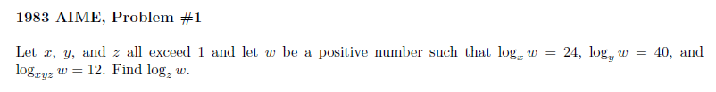

# 1 Binomial Expansion and Equations

## Question 1

$\log_xw=24$

$\log_yw=40$

$\log_{xyz}w=12$

$x^w=24$

$2x=xyz$

Convert to exponential form

$x^{24}=w,y^{40}=w,(xyz)^{12}=w$

Now convert everything to powers of $120$

$x^{120}=w^5,y^{120}=w^3,(xyz)^{120}=w^{10}$

$w^5w^3z^{120}=w^{10}$

## Question 2

Let $y=\sqrt[4]x$, then we have $y(7-y)=12$

$y^2-7y+12=(y-3)(y-4)=0$

Then, $\sqrt[4]x=y=3$ or $4$

$4^4+3^4$