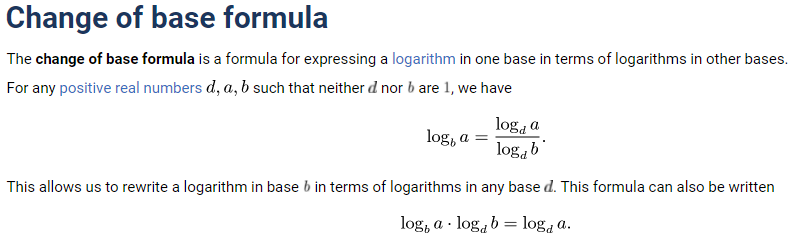

### 1988 AIME Problem 2

$k$ is some positive integer

Then

$f_1(k)=x^2$ where $x$ is the sum of the digits of $k$

$f_1(11)=4$

$f_2(11)=f_1(4)=16$

$f_3(11)=f_1(16)=49$

$f_4(11)=f_1(49)=169$

$f_5(11)=f_1(169)=256$

$f_6(11)=f_1(256)=169$

### 1986 AIME Problem 3

$\cot$ is the reciprocal of $\tan$:

$\cot x+\cot y=\frac{1}{\tan x}+\frac{1}{\tan y}=\frac{\tan x+\tan y}{\tan x\cdot\tan y}=30$

$\tan x\cdot\tan y=\frac{\tan x+\tan y}{30}=\frac{25}{30}=\frac{5}{6}$

Tangent addition formula (huh?), oh, $\tan(x+y)=\frac{\tan x+\tan y}{1-\tan x\tan y}=\frac{25}{\frac{1}{6}}=\boxed{150}$

### 1988 AIME Problem 3

First raise both exponents with base $8$

$8^{\log_2(\log_8x)}=8^{\log_8(\log_2x)}$

$2^{3\log_2(\log_8x)}=\log_2x$

$(\log_8x)^3=\log_2x$

$\frac{\log_2x}{\log_28}^3=\log_2x$

$(\log_2x)^2=(\log_28)^3=\boxed{027}$

### 1984 AIME Problem 5

Change of base formula:

See that $\frac{\log a}{\log 8}+\frac{2\log b}{\log 4}=5$

Combine the denominators to see:

$\frac{\log ab^3}{3\log 2}=5$

$\frac{\log a^3b}{3\log 2}=7$

Then, $\log ab^3=15\log 2\implies ab^3=2^{15}$ and that $\log a^3b=21\log 2\implies a^3b=2^21$

$a^4b^4=2^{36}$

$ab=2^9$

### 1994 AIME Problem 3

$f(94)=94^2-f(93)=94^2-93^2+f(92)=94^2-93^2+92^2-f(91)=...$

$=94+93+...+21+400-94$

$=4561$

Then, the remainder is $561$
